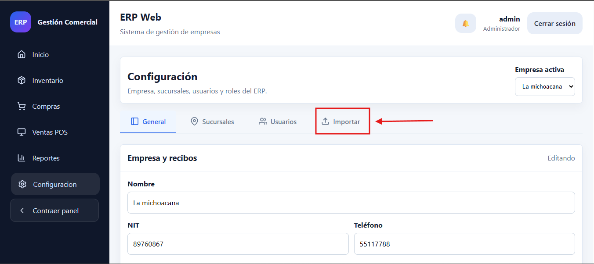
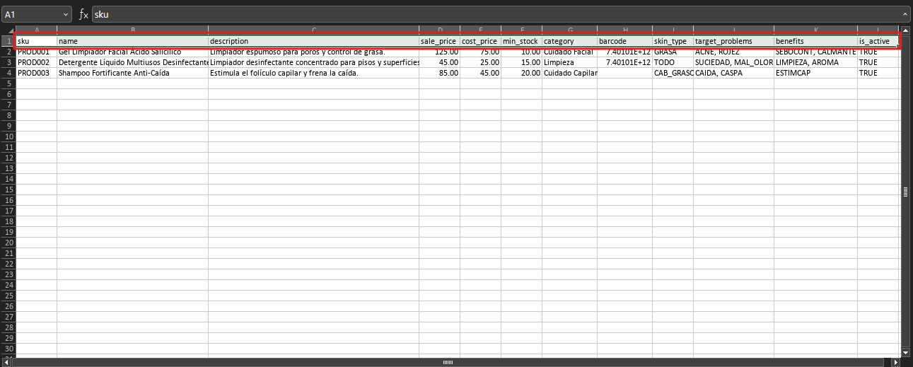
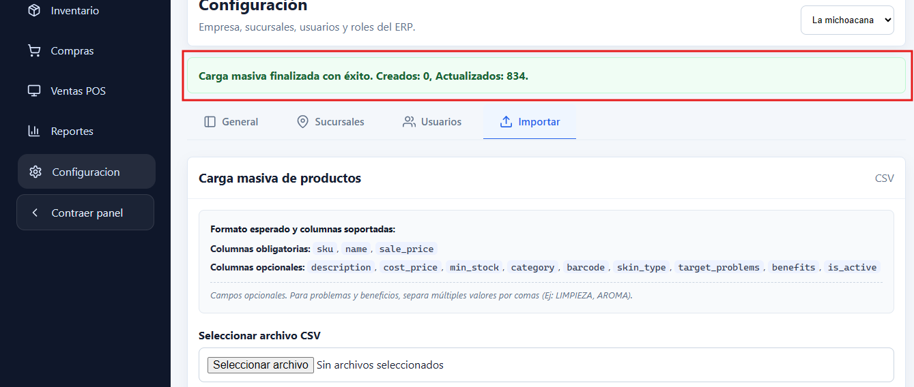

# Manual de Usuario: Carga Masiva de Productos e Importación Semántica

**Módulo:** Administración y Configuración / Inventario  
**Audiencia:** Administradores del Sistema, Gestores de Catálogo e Inventario  
**Versión del Documento:** 1.0.0  
**Fecha de Publicación:** Octubre 2026  

---

## 1. Objetivo del Manual

Este manual describe el procedimiento para realizar la **Carga Masiva de Productos** mediante archivos en formato **CSV** (*Comma-Separated Values*) dentro del sistema ERP.

La herramienta permite a los administradores:
1. **Crear nuevos productos por lote**, reduciendo significativamente el tiempo de digitación manual.
2. **Actualizar precios, descripciones y configuraciones** de productos existentes de forma masiva (mecanismo *Upsert* basado en el código `sku`).
3. **Alimentar el motor de búsqueda semántica y recomendaciones del Punto de Venta (POS)** mediante la asignación de atributos estandarizados (`skin_type`, `target_problems` y `benefits`).

<div style="page-break-after: always;"></div>

## 2. Ubicación y Acceso en el Sistema

Para acceder a la funcionalidad de carga masiva, el usuario debe tener una cuenta activa con el rol de **Administrador** (`admin`).

### Procedimiento paso a paso:
1. Inicie sesión en la plataforma ERP con sus credenciales administrativas.
2. En la barra de navegación lateral izquierda, localice y haga clic en la opción **Configuración** (ícono de engranaje). La URL correspondiente es `/admin/config`.
3. En la parte superior de la pantalla de Configuración, observe la barra de pestañas (**General**, **Sucursales**, **Usuarios**, **Importar**).
4. Haga clic en la pestaña **Importar** (identificada con el ícono de subida de archivos).
5. Se desplegará el panel titulado **"Carga masiva de productos (CSV)"**.


<!-- > **Nota para el desarrollador:** Aquí debes insertar una captura de pantalla que muestre la barra lateral de navegación con la opción 'Configuración' resaltada y la pestaña 'Importar' activa con el panel de carga de archivos CSV visible en el área de trabajo principal. -->

<div style="page-break-after: always;"></div>

## 3. Preparación del Archivo CSV

Antes de intentar subir datos al sistema, es fundamental estructurar correctamente el archivo en su hoja de cálculo preferida (Microsoft Excel, Google Sheets, LibreOffice Calc) y exportarlo como archivo delimitado por comas (`.csv`).

### 3.1 Especificaciones Técnicas del Archivo
* **Extensión obligatoria:** `.csv`
* **Codificación recomendada:** `UTF-8` o `UTF-8 con BOM` (esta última previene problemas con tildes y caracteres especiales al exportar desde Excel).
* **Separador de campos:** Coma (`,`). Si los valores contienen comas o caracteres especiales, deben ir encerrados entre comillas dobles (`"valor"`).
* **Separador decimal:** Punto (`.`), por ejemplo: `125.50` (evite usar coma decimal `125,50`).
* **Fila de encabezados:** La primera fila del archivo debe contener estrictamente los nombres de las columnas en minúsculas y sin acentos.

---

### 3.2 Estructura de Columnas: Obligatorias vs. Opcionales

El sistema valida cada fila del archivo CSV. Si falta una sola columna obligatoria en la cabecera o algún valor mandatorio en una fila, el proceso se detendrá para proteger la integridad del catálogo.

#### A. Columnas Obligatorias

| Columna | Tipo de Dato | Longitud / Formato | Descripción y Reglas de Negocio |
| :--- | :--- | :--- | :--- |
| `sku` | Alfanumérico | Hasta 60 caracteres | **Código Único del Producto.** Identificador principal en el ERP. El sistema lo convierte automáticamente a mayúsculas y elimina espacios sobrantes. Si el `sku` ya existe en la base de datos, el producto se actualizará; si no existe, se creará uno nuevo. No puede repetirse dentro del mismo archivo. |
| `name` | Texto | Hasta 180 caracteres | **Nombre comercial del producto.** Es el título principal que visualizarán cajeros, vendedores y clientes en boletas y reportes. |
| `sale_price` | Decimal | Positivo (`>= 0.00`) | **Precio de venta unitario al público.** Expresado en Quetzales (GTQ) o la moneda base configurada. Debe usar punto como separador decimal (ej: `15.00`, `99.95`). |

#### B. Columnas Opcionales Estándar

| Columna | Tipo de Dato | Valor por Defecto | Descripción y Reglas de Negocio |
| :--- | :--- | :--- | :--- |
| `description` | Texto libre | Vacío | Explicación detallada del producto, modo de uso, especificaciones o ingredientes. |
| `cost_price` | Decimal | `0.00` | Precio de compra o costo unitario del producto. Utilizado para el cálculo de márgenes y reportes de rentabilidad. |
| `min_stock` | Decimal | `0.00` | Stock mínimo de seguridad. Cuando el inventario baje de este umbral, el sistema generará alertas de reabastecimiento. |
| `category` | Texto | Vacío | Nombre de la categoría asociada (ej: *Cuidado Facial*, *Licores*, *Limpieza*). **Nota:** Si la categoría escrita no existe en el catálogo, el sistema la creará automáticamente. |
| `barcode` | Alfanumérico | Vacío / Nulo | Código de barras estándar (EAN-13, UPC, Code-128). Si se especifica, debe ser **único** en todo el catálogo de productos. |
| `keywords` | Texto | Vacío | Palabras clave adicionales para afinar búsquedas directas en el punto de venta. |
| `is_active` | Booleano | `true` | Determina si el producto está disponible para la venta (`true` o `false`). Acepta: `true`, `false`, `1`, `0`, `yes`, `no`. |


<!-- > **Nota para el desarrollador:** Aquí debes insertar una captura de pantalla que muestre el archivo CSV abierto en una hoja de cálculo (Excel o Google Sheets) destacando los encabezados de columna en la primera fila y al menos dos filas de datos de prueba completadas. -->

<div style="page-break-after: always;"></div>

## 4. Nuevos Campos Semánticos para el Motor de Búsqueda (Crucial)

Nuestro ERP cuenta con un **motor de búsqueda semántica y de recomendación contextual** integrado en el Punto de Venta (POS). Cuando un cliente llega solicitando ayuda para una necesidad ("*tengo la piel reseca*", "*busco algo desinfectante para pisos*", "*tengo sed y calor*"), el vendedor puede escribir esa necesidad y el sistema recomendará de inmediato los productos más pertinentes, incluso si el nombre del producto no contiene esas palabras literales.

Para que este motor funcione eficazmente, se agregaron tres columnas opcionales al catálogo: **`skin_type`**, **`target_problems`** y **`benefits`**.

### 4.1 Reglas Generales de Llenado Semántico

1. **`skin_type` (Tipo de Piel o Aplicación Destino):**
   * Admite **un único valor** por producto.
   * Debe escribirse en mayúsculas exactamente como figura en el diccionario permitido.
   * Si el producto no aplica a una categoría específica, puede utilizarse `TODO` o dejarse en blanco.
2. **`target_problems` (Problemas o Necesidades Objetivo):**
   * Admite **uno o múltiples valores** separados por comas.
   * Ejemplo de una celda: `ACNE, ROJEZ` o `SED, NINGUNO`.
3. **`benefits` (Beneficios y Efectos Positivos):**
   * Admite **uno o múltiples valores** separados por comas.
   * Ejemplo de una celda: `SEBOCONT, CALMANTE` o `REFRESCANTE, ENTRETEN`.

> [!IMPORTANT]
> Respete los códigos exactos en mayúsculas (por ejemplo, use `GRASA` y no `Piel Grasa` ni `grasa`). Los valores fuera de catálogo no activarán la ponderación semántica automatizada en el Punto de Venta.

---

### 4.2 Diccionarios Oficiales de Valores Permitidos

A continuación se listan los códigos exactos que el backend procesa e indexa para cada atributo semántico:

#### Diccionario 1: `skin_type` (Tipo de Piel / Aplicación Principal)

| Código Exacto | Significado en el Sistema | Uso Recomendado / Rubro |
| :--- | :--- | :--- |
| `GRASA` | Piel Grasa | Dermocosmética, geles limpiadores astringentes, bases matificantes. |
| `SECA` | Piel Seca | Cremas nutritivas, leches corporales hidratantes intensivas. |
| `MIXTA` | Piel Mixta | Tratamientos equilibrantes de zona T (frente, nariz, barbilla). |
| `SENS` | Piel Sensible | Productos hipoalergénicos, calmantes o sin fragancia. |
| `NORM` | Piel Normal | Productos de mantenimiento de barrera cutánea sin afecciones. |
| `CAB_GRASO` | Cabello Graso | Shampoos purificantes, tónicos capilares para cuero cabelludo graso. |
| `CAB_SECO` | Cabello Seco | Acondicionadores, mascarillas y aceites de hidratación capilar. |
| `CONSUMO` | Consumo Humano | Abarrotes, botanas, bebidas, licores, enlatados y alimentos. |
| `ROPA` | Cuidado de la Ropa | Detergentes en polvo o líquidos, quitamanchas textiles, suavizantes. |
| `SUPERFICIES` | Limpieza de Superficies | Desinfectantes de pisos, limpiavidrios, cloro, desengrasantes de cocina. |
| `SALUD` | Salud General | Suplementos vitamínicos, analgésicos, curaciones, primeros auxilios. |
| `TODO` | Todo Uso | Productos multiusos generales o universales. |

---

#### Diccionario 2: `target_problems` (Problemas / Necesidades Objetivo)
*Para múltiples valores, separe con comas (Ej: `ACNE, MANCHAS`).*

| Código Exacto | Etiqueta en el Sistema | Rubro / Ejemplo de Aplicación |
| :--- | :--- | :--- |
| `ACNE` | Acné | Piel con espinillas, puntos negros, brotes inflamatorios. |
| `MANCHAS` | Manchas en la Piel | Hiperpigmentación, manchas solares, melasma. |
| `ARRUGAS` | Arrugas / Líneas de expresión | Signos de envejecimiento, flacidez o pérdida de elasticidad. |
| `CAIDA` | Caída de Cabello | Debilidad capilar, alopecia o quiebre excesivo. |
| `CASPA` | Caspa | Descamación capilar, picazón en el cuero cabelludo. |
| `ROJEZ` | Rojez / Irritación | Piel reactiva, rosácea, dermatitis o ardor post-afeitado. |
| `DOLOR` | Dolor / Malestar General | Dolor de cabeza, molestias musculares, inflamación física. |
| `SUCIEDAD` | Suciedad / Grasa Doméstica | Polvo, mugre incrustada, sarro, grasa de estufas y pisos. |
| `MANCHAS_ROPA` | Manchas en Ropa | Vino, café, grasa o suciedad difícil en prendas textiles. |
| `MAL_OLOR` | Mal Olor | Olores ambientales, humedad, malos olores en baños o cocina. |
| `SED` | Sed / Deshidratación | Necesidad de hidratación líquida, calor, resequedad bucal. |
| `HAMBRE` | Hambre / Antojo | Necesidad calórica, bocadillos, snacks, comida rápida. |
| `FALTA_ENERGIA` | Falta de Energía / Deficiencia | Fatiga, cansancio físico, necesidad de cafeína o vitaminas. |
| `NINGUNO` | Recreación / Ocio | Licores finos, golosinas de indulgencia, productos recreativos. |

---

#### Diccionario 3: `benefits` (Beneficios Ofrecidos)
*Para múltiples valores, separe con comas (Ej: `LIMPIEZA, DESINFEC`).*

| Código Exacto | Etiqueta en el Sistema | Rubro / Ejemplo de Aplicación |
| :--- | :--- | :--- |
| `HIDRAT` | Hidratación | Retención de agua en la piel, humectación profunda. |
| `SEBOCONT` | Control de Sebo | Regulación del brillo facial y exceso de grasa dérmica. |
| `ANTIAGE` | Anti-edad / Firmeza | Efecto tensor, estimulación de colágeno, antioxidante. |
| `DESPIGM` | Despigmentante / Aclarador | Unificación del tono cutáneo, aclarado de manchas. |
| `CALMANTE` | Calmante / Relajante | Alivio de irritaciones, sensación de confort dérmico. |
| `PROTSOL` | Protección Solar | Filtros UVA/UVB, pantallas solares. |
| `ESTIMCAP` | Estimulación Capilar | Activación de folículos, fortalecimiento de la raíz capilar. |
| `ALIVIO` | Alivio Rápido / Curativo | Eficacia analgésica o antiinflamatoria inmediata. |
| `LIMPIEZA` | Limpieza Profunda | Remoción de impurezas, desengrase, arrastre de suciedad. |
| `DESINFEC` | Desinfección / Antibacterial | Eliminación de gérmenes, bacterias y hongos. |
| `NUTRICION` | Nutrición / Alimentación | Aporte calórico, proteico o alimenticio balanceado. |
| `REFRESCANTE` | Refrescante / Quita Sed | Bebidas hidratantes, aguas minerales, efecto frío mentolado. |
| `AROMA` | Aromatizante / Perfumado | Fragancias placenteras para el ambiente o el cuerpo. |
| `ENTRETEN` | Entretenimiento / Social | Bebidas sociales, cócteles, reuniones y celebraciones. |

<div style="page-break-after: always;"></div>

## 5. Ejemplos Prácticos de Archivos CSV

A continuación se presentan escenarios reales de productos de distintas categorías para ilustrar cómo deben llenarse las filas.

### 5.1 Visualización en Tabla (Simulación de Hoja de Cálculo)

| sku | name | description | sale_price | cost_price | min_stock | category | barcode | skin_type | target_problems | benefits | is_active |
| :--- | :--- | :--- | :--- | :--- | :--- | :--- | :--- | :--- | :--- | :--- | :--- |
| `JAB-FAC-01` | Jabón Facial Anti-Acné Salicílico 150ml | Gel limpiador purificante para poros obstruidos | 110.00 | 65.00 | 12.00 | Cuidado Facial | 740100511101 | `GRASA` | `ACNE, ROJEZ` | `SEBOCONT, CALMANTE, LIMPIEZA` | `true` |
| `LIC-WHI-12` | Whisky Escocés 12 Años Reserva 750ml | Botella de whisky añejado en barricas de roble | 280.00 | 185.00 | 6.00 | Licores | 740100522202 | `CONSUMO` | `NINGUNO` | `ENTRETEN` | `true` |
| `DET-MULT-05`| Detergente Desinfectante Pino 1L | Limpiador líquido antibacterial multiusos | 32.50 | 18.00 | 24.00 | Limpieza | 740100533303 | `SUPERFICIES` | `SUCIEDAD, MAL_OLOR` | `LIMPIEZA, DESINFEC, AROMA` | `true` |
| `AGU-MIN-600`| Agua Mineral Purificada 600ml | Agua de manantial natural baja en sodio | 7.00 | 3.50 | 48.00 | Bebidas | 740100544404 | `CONSUMO` | `SED` | `HIDRAT, REFRESCANTE` | `true` |

---

### 5.2 Formato de Texto Plano (CSV Raw)

Este es el contenido exacto que debe tener el archivo de texto plano `.csv`:

```csv
sku,name,description,sale_price,cost_price,min_stock,category,barcode,skin_type,target_problems,benefits,is_active
JAB-FAC-01,Jabón Facial Anti-Acné Salicílico 150ml,"Gel limpiador purificante para poros obstruidos",110.00,65.00,12.00,Cuidado Facial,740100511101,GRASA,"ACNE, ROJEZ","SEBOCONT, CALMANTE, LIMPIEZA",true
LIC-WHI-12,Whisky Escocés 12 Años Reserva 750ml,"Botella de whisky añejado en barricas de roble",280.00,185.00,6.00,Licores,740100522202,CONSUMO,NINGUNO,ENTRETEN,true
DET-MULT-05,Detergente Desinfectante Pino 1L,"Limpiador líquido antibacterial multiusos",32.50,18.00,24.00,Limpieza,740100533303,SUPERFICIES,"SUCIEDAD, MAL_OLOR","LIMPIEZA, DESINFEC, AROMA",true
AGU-MIN-600,Agua Mineral Purificada 600ml,"Agua de manantial natural baja en sodio",7.00,3.50,48.00,Bebidas,740100544404,CONSUMO,SED,"HIDRAT, REFRESCANTE",true
```

> [!TIP]
> Observe cómo los campos que contienen comas internas (como `"ACNE, ROJEZ"`) están envueltos entre comillas dobles. Los programas de hojas de cálculo como Excel o Calc se encargan automáticamente de colocar estas comillas al guardar como `.csv`.

<div style="page-break-after: always;"></div>

## 6. Proceso de Ejecución de la Carga Masiva

Una vez preparado y guardado el archivo CSV en su computador, proceda con la carga:

### Paso 1: Descargar la Plantilla de Muestra (Opcional pero Recomendado)
Si es la primera vez que realiza el procedimiento, en la pestaña **Importar** haga clic en el botón secundario **"Descargar muestra"**. El sistema descargará un archivo llamado `productos_muestra.csv` que ya cuenta con los encabezados exactos y filas de ejemplo.

### Paso 2: Seleccionar el Archivo
Haga clic en el campo **"Seleccionar archivo CSV"** o presione el botón de exploración de archivos de su navegador y elija el archivo `.csv` que preparó.

### Paso 3: Ejecutar la Importación
Haga clic en el botón principal **"Importar productos"**. El botón cambiará de estado a *"Cargando..."* mientras el servidor procesa y valida las transacciones.

### Paso 4: Confirmación del Resultado
Si el archivo cumple con todas las reglas, el sistema mostrará una alerta verde con el resumen de la operación:
* **Mensaje:** *"Carga masiva finalizada con éxito."*
* Cantidad de productos **creados** (SKUs nuevos).
* Cantidad de productos **actualizados** (SKUs que ya existían y cuyos campos se refrescaron).


<!-- > **Nota para el desarrollador:** Aquí debes insertar una captura de pantalla que muestre la alerta verde de éxito desplegada debajo del botón de importación, indicando el número exacto de registros creados y actualizados. -->

<div style="page-break-after: always;"></div>

## 7. Manejo de Errores y Preguntas Frecuentes

La importación opera de manera **atómica**: si una sola fila del archivo contiene errores de validación, **ningún producto será guardado ni alterado**, garantizando que su base de datos nunca quede en un estado inconsistente.

### 7.1 Visualización de Errores en Pantalla
Si el archivo contiene fallos, se desplegará una alerta de color rojo que especifica el número de línea del archivo, el `sku` afectado y el motivo del error.


<!-- > **Nota para el desarrollador:** Aquí debes insertar una captura de pantalla que muestre el recuadro rojo de alerta con la lista de errores detectados (ej: 'Línea 4 (SKU: PROD003): El campo sale_price debe ser un número válido'). -->

---

### 7.2 Errores Comunes y Soluciones

#### 1. "El archivo CSV no contiene las columnas obligatorias: ..."
* **Causa:** El encabezado del archivo no incluye `sku`, `name` o `sale_price`, o están mal escritos.
* **Solución:** Verifique la primera fila del archivo CSV. Asegúrese de que los nombres estén en minúsculas y sin espacios adicionales.

#### 2. "El SKU 'XYZ' está duplicado en el archivo."
* **Causa:** Hay dos o más filas en el mismo archivo CSV que tienen el mismo valor en la columna `sku`.
* **Solución:** Cada fila debe tener un `sku` único. Si deseaba actualizar un producto dos veces, consolide la información en una sola fila.

#### 3. "El código de barras '...' ya está registrado en el producto '...'"
* **Causa:** Se intentó asignar un código de barras que ya pertenece a otro producto existente en el ERP.
* **Solución:** Los códigos de barras son estrictamente únicos. Asigne un código de barras distinto o deje la celda vacía si no aplica.

#### 4. "El campo 'sale_price' debe ser un número válido / no puede ser negativo."
* **Causa:** El precio contiene letras, símbolos de moneda (ej: `$125.00` o `Q50.00`) o una coma decimal (ej: `125,00`).
* **Solución:** Utilice únicamente números con punto decimal: `125.00`. No incluya símbolos de moneda ni separadores de miles.

#### 5. "El archivo debe tener formato CSV (.csv)."
* **Causa:** Se intentó subir un archivo en formato `.xlsx`, `.xls` o `.txt`.
* **Solución:** Abra el archivo en Excel y seleccione **Guardar como > CSV (delimitado por comas) (*.csv)**.

#### 6. Caracteres extraños o signos de interrogación en nombres con tilde o letra Ñ
* **Causa:** El archivo fue guardado con codificación `ANSI` o `ISO-8859-1` en lugar de `UTF-8`.
* **Solución:** Al guardar desde Excel, elija **CSV UTF-8 (delimitado por comas) (*.csv)**. Nuestro ERP procesa nativamente archivos codificados en UTF-8 con o sin marca BOM.

<div style="page-break-after: always;"></div>

## 8. Resumen de Buenas Prácticas

1. **Haga pruebas con lotes pequeños:** Si va a importar un catálogo de miles de artículos por primera vez, pruebe primero con 5 o 10 filas para familiarizarse con las validaciones.
2. **Utilice la descarga de muestra:** Aproveche el botón "Descargar muestra" como base para asegurarse de tener los nombres de columna idénticos.
3. **Aproveche la actualización masiva:** Puede exportar sus productos, ajustar precios en masa en Excel y volverlos a cargar con el mismo `sku` para aplicar ajustes de tarifas en minutos.
4. **Enriquezca los datos semánticos:** Dedique tiempo a catalogar `skin_type`, `target_problems` y `benefits`. La velocidad de atención y venta de su equipo de mostrador en el POS mejorará sustancialmente gracias a las recomendaciones automáticas.
