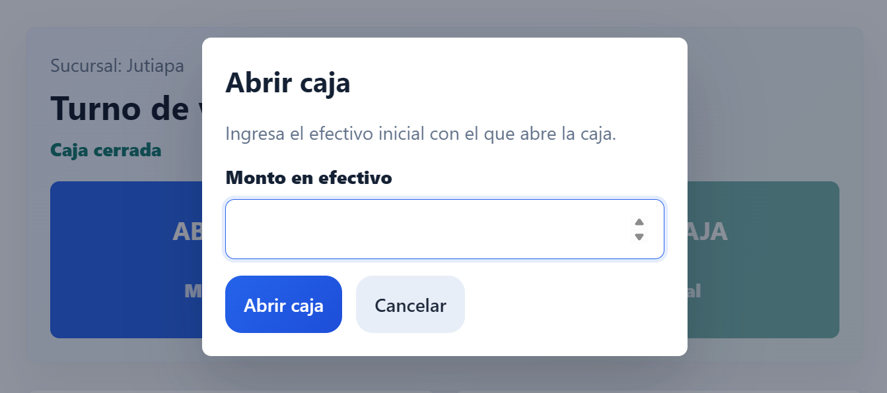
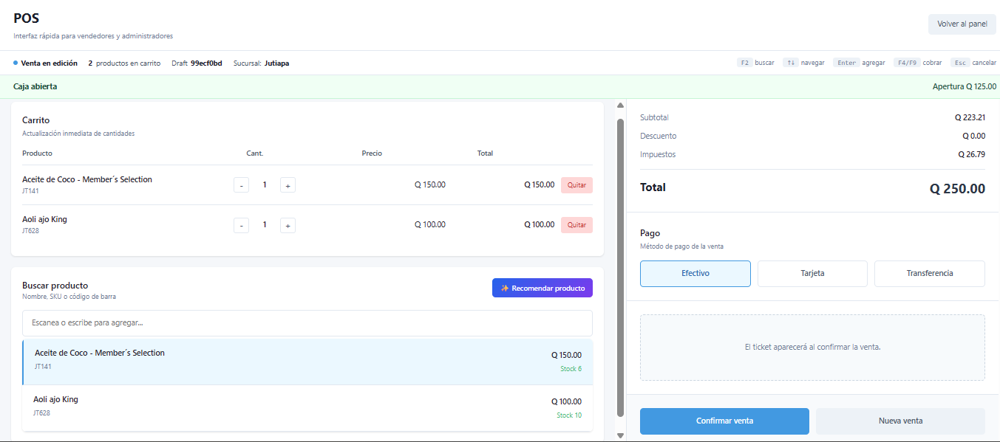
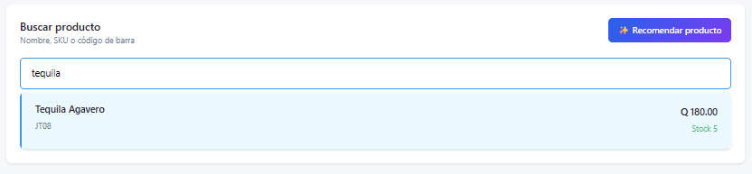
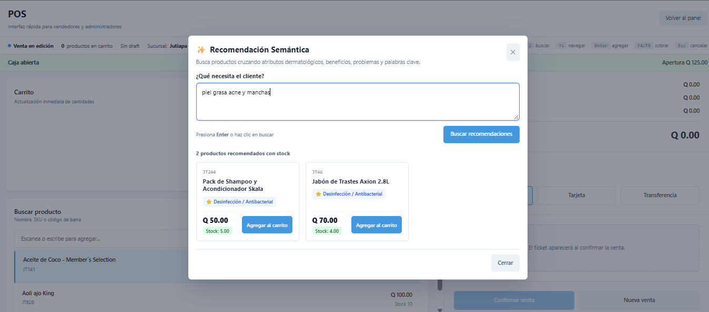
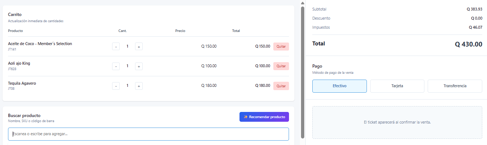
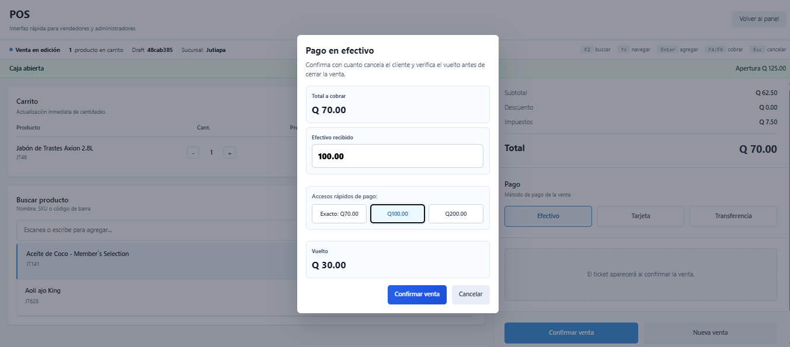
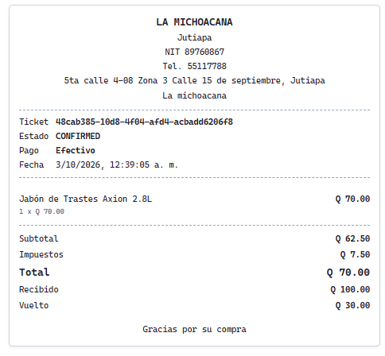

# Manual de Usuario: Punto de Venta (POS) y Recomendador Semántico

**Módulo:** Ventas / Punto de Venta (POS)  
**Audiencia:** Vendedores (`sales`), Cajeros, Encargados de Tienda y Administradores (`admin`)  
**Versión del Documento:** 1.0.0  
**Fecha de Publicación:** Octubre 2026  

---

## 1. Objetivo del Manual e Introducción

El presente manual tiene como objetivo guiar al personal de ventas y administración en el uso integral del **Punto de Venta (POS)** del sistema ERP. Esta herramienta fue diseñada pensando en la agilidad del mostrador, la fiabilidad del control de inventarios y una atención al cliente de excelencia.

Entre los aspectos más destacados de este módulo se encuentran:
1. **Control de turnos y seguridad financiera:** Registro riguroso de fondos de apertura, ventas en efectivo y cuadres de caja.
2. **Operación de alta velocidad:** Búsqueda reactiva de productos mediante código de barras, SKU o nombre, con navegación 100% operable por teclado mediante atajos rápidos.
3. **Recomendador Semántico Inteligente:** Asistente integrado basado en procesamiento de lenguaje natural y búsqueda por atributos que permite asesorar al cliente según sus necesidades específicas, dolores o preferencias.
4. **Cálculo automatizado de vuelto y accesos rápidos de billetes:** Eliminación de errores de digitación y agilización de filas al cobrar en efectivo.
5. **Emisión e impresión de tickets térmicos:** Desglose fiscal claro, detalle de compra y auto-impresión inmediata.

<div style="page-break-after: always;"></div>

## 2. Requisito Indispensable: Apertura de Caja (Inicio de Turno)

Por normativas de auditoría y trazabilidad contable, **el sistema no permite registrar ventas si el cajero no tiene un turno de caja abierto en su sucursal activa**. 

Si un usuario intenta operar el POS con la caja cerrada, el sistema mostrará el banner de alerta **"Abre caja desde el dashboard POS antes de vender."** y mantendrá bloqueados la barra de búsqueda y los botones de cobro.

```
       ┌────────────────────────────────────────────────────────┐
       │             FLUJO DE INICIO DE TURNO                   │
       └──────────────────────────┬─────────────────────────────┘
                                  ▼
                    ┌───────────────────────────┐
                    │     Ingreso al Sistema    │
                    │         (/app)            │
                    └─────────────┬─────────────┘
                                  ▼
                    ┌───────────────────────────┐
                    │ ¿Caja abierta en turno?   │
                    └──────┬─────────────┬──────┘
                       NO  │             │  SÍ
                           ▼             ▼
             ┌───────────────────┐  ┌───────────────────┐
             │ Clic "Abrir caja" │  │ Clic "Nueva venta"│
             │ Ingresar fondo Q  │  │   Acceso al POS   │
             │    Confirmar      │  │      (/pos)       │
             └─────────┬─────────┘  └───────────────────┘
                       │
                       └────────► [Caja Abierta] ──► [Operar POS]
```

### 2.1 Procedimiento de Apertura de Caja

1. Inicie sesión en el ERP con sus credenciales de **Vendedor** o **Administrador**.
2. Diríjase a la pantalla principal (**Dashboard** en la ruta `/app`).
3. En la sección superior **Turno de ventas**, observe el estado actual. Si se muestra el distintivo **"Caja cerrada"**, el botón principal disponible será **Abrir caja**.
4. Haga clic en el botón **Abrir caja** (subtítulo: *Monto inicial*).
5. Se abrirá la ventana modal de arqueo inicial:
   * **Monto inicial (Q):** Ingrese la cantidad exacta de efectivo en billetes y monedas con la que recibe el cajón de dinero (fondo de caja para cambio/vuelto). Por ejemplo: `200.00`.
6. Haga clic en **Abrir caja**.
7. Inmediatamente el sistema cambiará el estado a **"Caja abierta"**, reflejará el monto de apertura y habilitará el botón verde brillante **Nueva venta** (*Abrir POS*).


<!-- > **Nota para el desarrollador:** Aquí debes insertar una captura de pantalla que muestre la sección 'Turno de ventas' del Dashboard con el estado 'Caja cerrada', el modal 'Abrir caja' desplegado con el campo de monto inicial listo para ingresar datos y los botones de acción principales. -->

> [!IMPORTANT]
> Cada sesión de caja está vinculada exclusivamente al usuario que la abrió. Si otro usuario con sesión activa intenta vender desde la misma sucursal mientras una caja ajena está en curso, el sistema indicará: *"Caja abierta por [Nombre del Cajero]"* y el botón dirá *"Caja ajena"*, evitando que los fondos de distintos empleados se mezclen en un solo arqueo.

<div style="page-break-after: always;"></div>

## 3. Interfaz Principal y Navegación del POS

Una vez abierta la caja, al hacer clic en **Nueva venta** o ingresar directamente a `/pos`, se presentará la interfaz principal del Punto de Venta.

La pantalla está organizada en dos áreas de trabajo ergonómicas:

```
┌─────────────────────────────────────────────────────────────────────────────┐
│ POS - Interfaz rápida para vendedores y administradores    [Volver al panel]│
├─────────────────────────────────────────────────────────────────────────────┤
│ Sucursal: Central | Estado: Sincronizado | 🛒 Carrito: 2 items | Caja Abierta│
├──────────────────────────────────────┬──────────────────────────────────────┤
│          COLUMNA IZQUIERDA           │           COLUMNA DERECHA            │
│ ┌──────────────────────────────────┐ │ ┌──────────────────────────────────┐ │
│ │ 🛒 Carrito de Compras            │ │ │ 💰 Resumen de Totales            │ │
│ │  - Item 1   [-] [2] [+]   Q25.00 │ │ │   Subtotal:              Q75.00  │ │
│ │  - Item 2   [-] [1] [+]   Q50.00 │ │ │   Impuestos:              Q0.00  │ │
│ └──────────────────────────────────┘ │ │   TOTAL:                 Q75.00  │ │
│ ┌──────────────────────────────────┐ │ └──────────────────────────────────┘ │
│ │ 🔍 Buscar producto               │ │ ┌──────────────────────────────────┐ │
│ │ [✨ Recomendar producto]         │ │ │ 💳 Método de Pago                │ │
│ │ [ Barra de búsqueda / Lector   ] │ │ │   [Efectivo] [Tarjeta] [Transf]  │ │
│ │                                  │ │ └──────────────────────────────────┘ │
│ │  Lista de resultados:            │ │ ┌──────────────────────────────────┐ │
│ │  > Crema Hidratante (Q50) Stk:12 │ │ │ 🧾 Ticket de Venta               │ │
│ │  > Shampoo Anticaspa (Q30) Agot. │ │ │   (Vista previa para impresión)  │ │
│ └──────────────────────────────────┘ │ └──────────────────────────────────┘ │
│                                      │ [ Confirmar venta ]   [ Nueva venta] │
│                                      │ [ Anular          ]   [ Imprimir   ] │
└──────────────────────────────────────┴──────────────────────────────────────┘
```

### Componentes de la Interfaz:
* **Barra Superior de Estado (`SaleStatusBar`):** Muestra en todo momento la sucursal actual asignada, el identificador del borrador en curso y el estado de sincronización en tiempo real (*Sincronizado*, *Guardando...*).
* **Indicador de Caja (`cash-status`):** Franja visual verde que ratifica que la caja está activa, indicando la cifra de apertura (ej. `Apertura Q 200.00`).
* **Pestañas Móviles / Responsive (`pos-tabs`):** En dispositivos táctiles o pantallas compactas, permite alternar rápidamente entre la vista de **🔍 Buscar productos** y el desglose de **🛒 Carrito**.
* **Columna Izquierda:** Contiene el listado de productos cargados al carrito y el bloque interactivo de búsqueda de productos.
* **Columna Derecha:** Concentra los totales monetarios calculados por el servidor, los selectores de método de pago, la vista previa del ticket y los botones de acción final.


<!-- > **Nota para el desarrollador:** Aquí debes insertar una captura de pantalla completa de la pantalla del POS (`/pos`) que muestre ambas columnas: a la izquierda la barra de búsqueda con el botón '✨ Recomendar producto' y dos productos en el carrito, y a la derecha los totales calculados, la selección de método de pago y los botones de confirmación. -->

<div style="page-break-after: always;"></div>

## 4. Búsqueda y Selección de Productos (Búsqueda Básica)

La búsqueda de productos es el corazón operativo del vendedor. El sistema incorpora un buscador multifunción optimizado para responder al instante conforme el usuario escribe o escanea.

### 4.1 Métodos de Entrada Admitidos

1. **Lectura con Pistola de Código de Barras (Recomendado para mostrador):**
   * El cursor se ubica por defecto en la caja de texto **"Escanea o escribe para agregar..."**.
   * Al accionar el lector láser sobre el código de barras (`barcode` EAN-13, UPC, Code-128) del envase o empaque, el escáner transmite la cadena numérica y envía un comando `Enter`.
   * El sistema localiza el producto con coincidencia exacta y lo suma automáticamente al carrito de compras.
2. **Búsqueda por SKU (Código Único de Inventario):**
   * Digite el código SKU (ej. `SHAM-001`, `GAL-CHOC-01`). La lista filtrará de inmediato los artículos que coincidan.
3. **Búsqueda por Nombre Comercial o Palabras Clave:**
   * Escriba una o varias palabras del producto (ej. *"detergente"*, *"leche descremada"*, *"bloqueador solar"*).
   * La lista desplegará las opciones disponibles mostrando el nombre comercial, SKU, precio unitario y unidades en existencia.

---

### 4.2 Control Automático de Existencias (Productos Sin Stock)

Para evitar discrepancias entre el inventario físico y el sistema, **el ERP no permite vender artículos que carezcan de stock en la sucursal del vendedor**.

* **Productos con inventario disponible:** Se muestran con texto nítido, el precio en color verde y la etiqueta de stock en azul (ej. `Stock 24`). Pueden seleccionarse haciendo clic sobre ellos o presionando `Enter`.
* **Productos agotados (`stock <= 0`):**
  * La fila aparece en tono grisáceo opaco.
  * Se exhibe claramente el distintivo rojo **"Sin stock"**.
  * El botón queda **completamente deshabilitado (`disabled`)**, impidiendo que se agregue al carrito tanto por clic del ratón como por teclado.


<!-- > **Nota para el desarrollador:** Aquí debes insertar una captura de pantalla de la lista desplegable de resultados de búsqueda en el POS, donde se aprecien con claridad al menos dos productos con existencias disponibles listos para ser seleccionados y un producto en estado deshabilitado con el distintivo rojo 'Sin stock'. -->

<div style="page-break-after: always;"></div>

## 5. Recomendador Semántico: Asistencia Inteligente al Cliente (Característica Estrella)

En el día a día del mostrador, los clientes frecuentemente solicitan asesoría sin conocer el nombre técnico ni la marca del producto que necesitan:

> *"Buenas tardes, fíjese que tengo la piel muy brillosa y con granitos en la frente, ¿qué producto me recomienda?"*  
> *"Busco un desinfectante para pisos de baño que tenga un aroma fresco y elimine manchas de sarro..."*  
> *"Quiero algo para la caída del cabello graso..."*

Para estos escenarios, el ERP cuenta con el **Recomendador Semántico**, un asistente interactivo capaz de comprender necesidades en lenguaje humano y transformarlas en sugerencias comerciales precisas en cuestión de milisegundos.

```
                  ┌──────────────────────────────────────────────┐
                  │          CONSULTA DEL CLIENTE EN POS         │
                  │   "Tengo piel grasa y busco controlar        │
                  │        el brillo y el acné"                  │
                  └──────────────────────┬───────────────────────┘
                                         ▼
                  ┌──────────────────────────────────────────────┐
                  │    MOTOR SEMÁNTICO POSTGRESQL (FULL-TEXT)    │
                  ├──────────────────────────────────────────────┤
                  │  Ponderación A: Nombre y Palabras Clave      │
                  │  Ponderación B: skin_type: GRASA             │
                  │                 target_problems: ACNE        │
                  │                 benefits: SEBOCONT           │
                  │  Ponderación C: Descripción del Producto     │
                  │  Filtro Estricto: Stock > 0 en Sucursal      │
                  └──────────────────────┬───────────────────────┘
                                         ▼
                  ┌──────────────────────────────────────────────┐
                  │            SUGERENCIAS AL VENDEDOR           │
                  │  ⭐ Gel Limpiador Matificante  (Stock: 8)    │
                  │  ⭐ Tónico Astringente BHA     (Stock: 3)    │
                  │  [+ Agregar al Carrito]                      │
                  └──────────────────────────────────────────────┘
```

### 5.1 Cómo Usar el Recomendador Semántico

1. En la sección **Buscar producto**, localice el botón superior derecho con diseño destacado: **✨ Recomendar producto**.
2. Al pulsar el botón, emergerá la ventana modal **"Recomendación Semántica"**. El cursor se posicionará de forma automática en el cuadro de texto.
3. En el campo **¿Qué necesita el cliente?**, escriba con naturalidad los síntomas, tipo de superficie, preferencias o afección expresada por el comprador.
4. Presione la tecla **Enter** (o haga clic en el botón azul **Buscar recomendaciones**).
5. El sistema procesará la solicitud y presentará un catálogo en cuadrícula de tarjetas con los productos más afines. Cada tarjeta contiene:
   * **SKU y Nombre Comercial:** Identificación clara del artículo.
   * **Insignia de Beneficio Principal:** Etiqueta con estrella que sintetiza la virtud más destacada (ej. `⭐ Sebocontrolador / Matificante`, `⭐ Hipoalergénico / Piel Sensible`, `⭐ Limpieza Profunda`).
   * **Precio y Stock en Sucursal:** Para ofrecer información veraz sobre el costo y la disponibilidad inmediata.
   * **Botón de Adición Rápida:** Al hacer clic en **Agregar al carrito**, el producto se suma a la orden actual y el botón cambia de inmediato a color verde con la leyenda **✓ En carrito**. El vendedor puede agregar varios productos recomendados consecutivamente sin abandonar el modal.
6. Haga clic en **Cerrar** (o presione `Esc`) para retornar a la pantalla principal del POS con los productos ya incorporados en el carrito.

---

### 5.2 Lógica Técnica del Motor Semántico (Bajo el Capó)

Para los Administradores e Implementadores técnicos, es importante comprender cómo opera el algoritmo en el servidor:

1. **Cruce Multiatributo:** El motor no se limita a buscar coincidencias literales de texto. Cruza el texto ingresado contra las columnas semánticas del catálogo:
   * **`skin_type`:** Mapea términos dermatológicos o de aplicación doméstica (`GRASA`, `SECA`, `MIXTA`, `SENS`, `CONSUMO`, `SUPERFICIES`, etc.).
   * **`target_problems`:** Reconoce dolencias y necesidades (`ACNE`, `MANCHAS`, `MANCHAS_ROPA`, `GRASA_COCINA`, `SARRO`, `CASPA`, etc.).
   * **`benefits`:** Evalúa efectos deseados (`SEBOCONT`, `HIDRATACION`, `DESINFECTANTE`, `ANTICASPA`, `QUITAMANCHAS`, etc.).
   * **`keywords` y `name`:** Términos sinónimos y títulos comerciales.
2. **Ponderación Jerárquica (PostgreSQL Full-Text Search):**
   * **Peso A (Prioridad Máxima):** Coincidencias en el Nombre del Producto y Palabras Clave (`keywords`).
   * **Peso B (Prioridad Alta):** Coincidencias en Beneficios (`benefits`), Problemas Objetivo (`target_problems`) y Tipo de Piel/Uso (`skin_type`).
   * **Peso C (Prioridad Media):** Coincidencias en la Descripción extendida del producto.
3. **Filtro Estricto de Disponibilidad por Sucursal:** Un producto perfectamente compatible **nunca** será sugerido si su stock en la sucursal actual es igual a cero. Esto previene ofrecer productos que no se pueden despachar de inmediato.


<!-- > **Nota para el desarrollador:** Aquí debes insertar una captura de pantalla del modal '✨ Recomendación Semántica' abierto, mostrando una consulta de ejemplo en el área de texto (ej. 'piel grasa acné y manchas') y debajo al menos dos tarjetas de productos sugeridos con sus insignias de beneficios en estrella, stock disponible y el botón verde '✓ En carrito'. -->

<div style="page-break-after: always;"></div>

## 6. Atajos de Teclado y Operación de Alta Velocidad (Sin Ratón)

En horas pico, el uso continuo del mouse ralentiza la atención en el mostrador. Por ello, el POS está 100% equipado con atajos de teclado globales ergonómicos.

| Tecla de Acceso Rápido | Función en el Sistema | Descripción Operativa |
| :---: | :--- | :--- |
| **`F2`** | **Enfocar Búsqueda** | Coloca el cursor inmediatamente en el campo de búsqueda de productos, seleccionando cualquier texto previo para escanear o escribir sin tocar el mouse. |
| **`Flecha Abajo` ($\downarrow$)** | **Siguiente Producto** | Desciende en la lista de productos encontrados en la búsqueda, iluminando el artículo seleccionado. |
| **`Flecha Arriba` ($\uparrow$)** | **Producto Anterior** | Sube en la lista de resultados de búsqueda. Si está en el primer elemento, vuelve al último (navegación circular). |
| **`Enter`** | **Agregar al Carrito** | Agrega de inmediato el producto resaltado al carrito de compras. Si se utiliza un escáner de códigos de barras, el lector envía este comando en automático. |
| **`F4` o `F9`** | **Ir a Cobrar / Confirmar** | Si el carrito contiene productos: abre la pantalla de cobro en efectivo o confirma la venta en pagos electrónicos. Dentro del modal de efectivo, confirma el pago con el vuelto calculado. |
| **`Esc` (Escape)** | **Cancelar / Cerrar** | Cierra cualquier modal abierto (Recomendador Semántico, Cobro en Efectivo, Anulación de Venta). Si no hay modales en pantalla, limpia el carrito de compras tras solicitar confirmación. |

> [!TIP]
> **Rutina recomendada para el cajero:**
> 1. Presione **`F2`** para posicionar el cursor.
> 2. Escriba las primeras letras del producto o pase el lector de código de barras.
> 3. Utilice las **`Flechas`** si requiere elegir una variante y pulse **`Enter`**.
> 4. Presione **`F4`** o **`F9`** para pasar directo al cobro.

<div style="page-break-after: always;"></div>

## 7. Gestión del Carrito de Ventas

El carrito de ventas se ubica en la columna izquierda superior y muestra cada ítem que el cliente llevará consigo.

```
┌────────────────────────────────────────────────────────────────────────┐
│ Crema Hidratante Facial Día                                            │
│ SKU: CREM-HID-01                                                       │
│   [-]   [ 2 ]   [+]       Unit: Q 45.00       Total: Q 90.00   [Quitar]│
└────────────────────────────────────────────────────────────────────────┘
```

### 7.1 Modificar Cantidades
El cajero dispone de dos alternativas para ajustar el número de unidades de un producto:
1. **Botones de Incremento y Decremento (`+` / `-`):**
   * Haga clic en `+` para añadir una unidad.
   * Haga clic en `-` para restar una unidad. Al llegar a 1, una pulsación adicional no lo eliminará (para borrar use el botón *Quitar*).
2. **Edición Numérica Directa:**
   * Haga clic sobre la caja numérica de cantidad, digite el número deseado (ej. `12`) y presione fuera del campo o presione `Tab`.
   * **Protección de Inventario:** El campo valida dinámicamente el valor ingresado contra el stock físico de la sucursal (`max={item.stock}`). Si un producto tiene 5 unidades en existencia y el cajero intenta digitar `8`, el sistema limitará el valor máximo al stock disponible para evitar sobreventas.

### 7.2 Eliminar un Ítem del Carrito
* Para retirar un producto por completo de la orden, haga clic en el botón rojo **Quitar** ubicado al extremo derecho de la fila. El renglón desaparecerá y los subtotales se recalcularán de inmediato.

### 7.3 Desglose Financiero en Tiempo Real (`CartTotals`)
En la columna derecha, el panel de totales presenta los montos calculados por el backend del ERP:
* **Subtotal:** Suma neta de los productos agregados.
* **Descuento:** Descuentos promocionales o convenios aplicados.
* **Impuestos:** Monto tributario correspondiente (IVA desglosado).
* **Total:** Monto definitivo a liquidar por parte del cliente.


<!-- > **Nota para el desarrollador:** Aquí debes insertar una captura de pantalla que muestre la sección del Carrito con 3 productos agregados, resaltando los controles de cantidad (+ / -), el botón 'Quitar' y el bloque de totales en la columna derecha. -->

<div style="page-break-after: always;"></div>

## 8. Proceso de Cobro, Métodos de Pago y Manejo de Efectivo

Una vez completado el carrito, el cajero procede a seleccionar la forma de pago en la sección **Pago**.

```
┌──────────────────────────────────────────────┐
│ Pago                                         │
│ Método de pago de la venta                   │
│ ┌──────────────┐ ┌───────────┐ ┌───────────┐ │
│ │ [•] Efectivo │ │ [ ]Tarjeta│ │ [ ]Transf.│ │
│ └──────────────┘ └───────────┘ └───────────┘ │
└──────────────────────────────────────────────┘
```

### 8.1 Métodos de Pago Disponibles

1. **Tarjeta (`CARD`):** Utilizado para pagos con tarjeta de débito o crédito a través de terminal POS bancaria (POS físico). Una vez procesado el voucher bancario, el cajero pulsa **Confirmar venta** (`F4` o `F9`) y la venta se cierra directamente sin solicitar cálculo de vuelto.
2. **Transferencia (`TRANSFER`):** Utilizado para transferencias electrónicas inmediatas o pagos móviles (Banca en Línea, Transferencia ACH). El cajero valida el comprobante y confirma la venta.
3. **Efectivo (`CASH` - Predeterminado):** Requiere verificación de billetes y cálculo de vuelto.

---

### 8.2 Cobro en Efectivo y Accesos Rápidos de Billetes

Al encontrarse seleccionado el método **Efectivo** y hacer clic en **Confirmar venta** (o presionar `F4` / `F9`), se abre la ventana modal interactiva **Pago en efectivo**.

```
┌────────────────────────────────────────────────────────┐
│ Pago en efectivo                                       │
│ Confirma con cuanto cancela el cliente y verifica el  │
│ vuelto antes de cerrar la venta.                       │
├────────────────────────────────────────────────────────┤
│ Total a cobrar:                                Q 75.00 │
│                                                        │
│ Efectivo recibido: [ Q 100.00                        ] │
│                                                        │
│ Accesos rápidos de pago:                               │
│ ┌──────────────┐ ┌──────────────┐ ┌──────────────┐    │
│ │ Exacto: Q75  │ │ Q 80.00      │ │ Q 100.00     │    │
│ └──────────────┘ └──────────────┘ └──────────────┘    │
│ ┌──────────────┐ ┌──────────────┐                     │
│ │ Q 150.00     │ │ Q 200.00     │                     │
│ └──────────────┘ └──────────────┘                     │
│                                                        │
│ Vuelto:                                        Q 25.00 │
├────────────────────────────────────────────────────────┤
│       [ Confirmar venta (F4) ]    [ Cancelar (Esc) ]   │
└────────────────────────────────────────────────────────┘
```

#### Elementos del Modal de Efectivo:
* **Total a cobrar:** Muestra la cantidad neta a pagar en letra destacada.
* **Efectivo recibido:** Campo de entrada numérica con foco automático. El sistema lo preinicializa con el monto exacto de la venta.
* **Accesos Rápidos de Pago (Botones Inteligentes):**
  * Para evitar digitar en el teclado numérico, el sistema calcula al vuelo una matriz de billetes y denominaciones lógicas:
    * **Pago Exacto:** Botón con la cifra exacta (`Exacto: Q [total]`).
    * **Billetes de Circulación Nacional:** Sugiere botones con denominaciones de billetes de Quetzales (`Q 10`, `Q 20`, `Q 50`, `Q 100`, `Q 200`) que sean mayores o iguales al total a cobrar.
    * **Múltiplos Redondeados:** Si la cuenta es de `Q 73.00`, el sistema sugiere botones redondeados hacia arriba a la decena (`Q 80.00`), a la cincuentena (`Q 100.00`), facilitando seleccionar con un solo clic el importe entregado por el comprador.
* **Cálculo de Vuelto en Tiempo Real:** 
  $$\text{Vuelto} = \max(0, \text{Efectivo Recibido} - \text{Total})$$
  Conforme se escribe o se presiona un acceso rápido, la cifra de **Vuelto** se actualiza al instante en pantalla, indicando con exactitud cuánto dinero en efectivo debe devolver el cajero.
* **Validación de Pago Insuficiente:** Si el monto digitado es menor al total de la venta, el sistema muestra la advertencia en rojo: *"El efectivo recibido debe cubrir el total"* y desactiva el botón de confirmación para impedir descuadres de caja.
* **Cierre Inmediato:** El cajero puede pulsar el botón azul **Confirmar venta** o simplemente oprimir la tecla **`F4`** o **`F9`**. Para abortar, presione `Esc` o el botón **Cancelar**.


<!-- > **Nota para el desarrollador:** Aquí debes insertar una captura de pantalla del modal 'Pago en efectivo' abierto en el POS, mostrando un total a cobrar de ejemplo (ej. Q 75.00), el campo de efectivo recibido en Q 100.00, la cuadrícula de 'Accesos rápidos de pago' con los botones de billetes y la cifra destacada de 'Vuelto: Q 25.00'. -->

<div style="page-break-after: always;"></div>

## 9. Finalización de la Venta, Ticket y Reimpresión

Al confirmar el cobro, el ERP ejecuta las siguientes acciones atómicas de manera simultánea en el servidor:
1. Cambia el estado de la venta a **`CONFIRMED`**.
2. Descuenta de inmediato las cantidades vendidas del inventario de la sucursal actual.
3. Si el pago fue en efectivo, suma el monto al rubro de **Efectivo esperado** del turno de caja del cajero.
4. Genera el ticket fiscal digital con un número correlativo único.

---

### 9.1 Visualización y Estructura del Ticket Térmico

En la parte inferior derecha del POS se renderiza el documento listo para comprobante de compra:

```
┌──────────────────────────────────────────────┐
│                   MI MINIMARKET              │
│               Sucursal Central               │
│               NIT: 12345678-9                │
│             Teléfono: 2200-0000              │
│       Calle Principal 5-20, Zona 1           │
│   ----------------------------------------   │
│   Ticket: #a8f2c3            Estado: CONFIRMED│
│   Pago: Efectivo                             │
│   Fecha: 02/10/2026, 18:45:10                │
│   ----------------------------------------   │
│   CANT. DESCRIPCIÓN                  TOTAL   │
│   2 x Q45.00 Crema Facial          Q 90.00   │
│   1 x Q15.00 Jabón Neutro          Q 15.00   │
│   ----------------------------------------   │
│   Subtotal:                       Q 105.00   │
│   Impuestos (IVA):                  Q 0.00   │
│   TOTAL:                          Q 105.00   │
│   Recibido:                       Q 200.00   │
│   Vuelto:                          Q 95.00   │
│   ----------------------------------------   │
│            ¡Gracias por su compra!           │
└──────────────────────────────────────────────┘
```

### 9.2 Auto-Impresión y Botones de Acción Posterior
* **Disparo Automático de Impresión:** Si el navegador tiene configurada una impresora térmica de recibos (58mm o 80mm), el sistema abre la ventana de diálogo de impresión automáticamente al registrarse la venta.
* **Botón Imprimir:** Permite reimprimir el comprobante en cualquier momento si la cinta térmica se atascó o el cliente solicita un duplicado.
* **Botón Nueva Venta:** Limpia la orden, restablece la barra de búsqueda y enfoca nuevamente el cursor para atender de inmediato al siguiente cliente.
* **Botón Anular (`btn-danger`):** Se habilita exclusivamente sobre la última venta confirmada. Si el cliente desiste de la compra inmediatamente tras pagar, el vendedor puede pulsar **Anular**, ingresar el motivo de cancelación en la ventana emergente y el sistema devolverá las unidades al stock y descontará el importe del turno de caja.


> **Nota para el desarrollador:** Aquí debes insertar una captura de pantalla que muestre la sección derecha del POS tras concretarse una venta, destacando el panel 'pos-ticket' con el desglose del comprobante, el número de ticket, los importes de recibido/vuelto y los botones 'Nueva venta' e 'Imprimir'.

<div style="page-break-after: always;"></div>

## 10. Preguntas Frecuentes y Solución de Problemas (FAQ)

### 1. ¿Por qué la barra de búsqueda dice "Tu usuario necesita una sucursal asignada" y está bloqueada?
* **Causa:** Su cuenta de usuario no tiene asignada una sucursal en el catálogo administrativo.
* **Solución:** Contacte a un usuario con rol de Administrador (`admin`) para que ingrese a **Configuración > Usuarios** y vincule su cuenta a la sucursal física correspondiente.

### 2. ¿Por qué el sistema no me deja cobrar y dice "Abre caja desde el dashboard POS antes de vender"?
* **Causa:** No ha iniciado un turno de caja hoy o la caja del día anterior fue cerrada.
* **Solución:** Haga clic en **Volver al panel** en la esquina superior derecha, diríjase al Dashboard (`/app`) y haga clic en el botón **Abrir caja** ingresando su fondo inicial en Quetzales.

### 3. Un cliente tiene un producto físico en sus manos pero en el POS aparece como "Sin stock". ¿Cómo proceder?
* **Causa:** Existe un desbalance entre el inventario físico y el sistema (posible ingreso de mercadería pendiente de recepción o ajuste de inventario no registrado).
* **Solución:** Por política de control, el cajero no puede vender en negativo. Debe notificar de inmediato al encargado de bodega o administrador para que realice un ajuste rápido de existencias desde el módulo de **Inventario**.

### 4. ¿Cómo reimprimo un ticket de una venta realizada horas antes?
* **Solución:** Vaya a **Volver al panel** (`/app`). En el bloque **Últimas ventas**, localice la transacción por su número o importe y presione el enlace **Reimprimir**.

### 5. ¿Cómo cierro mi turno de caja al finalizar la jornada?
* **Solución:** 
  1. Diríjase al Dashboard (`/app`).
  2. En el panel **Turno de ventas**, haga clic en **Cerrar caja** (*Conteo final*).
  3. Realice el conteo físico de los billetes y monedas de su gaveta e ingrese el total contado en el modal de cierre.
  4. El sistema comparará la cifra contra el **Efectivo esperado** (Apertura + Ventas en efectivo) y registrará el arqueo definitivo.

<div style="page-break-after: always;"></div>

## 11. Resumen de Buenas Prácticas para el Vendedor

1. **Verifique siempre el fondo inicial:** Cuente minuciosamente las monedas y billetes antes de colocar la cifra de apertura de caja.
2. **Utilice el Recomendador Semántico como herramienta de venta cruzada (*cross-selling*):** Cuando un cliente solicite un producto específico, use el modal para sugerirle complementos ideales según sus beneficios compatibles.
3. **Domine los atajos de teclado:** Operar con `F2`, `Flechas`, `Enter` y `F4` reduce a la mitad el tiempo de espera por cliente en la fila de cobro.
4. **Verifique el vuelto en pantalla antes de entregar el cambio:** Apóyese siempre en la cifra calculada por el modal para garantizar la exactitud de su arqueo al final del día.
